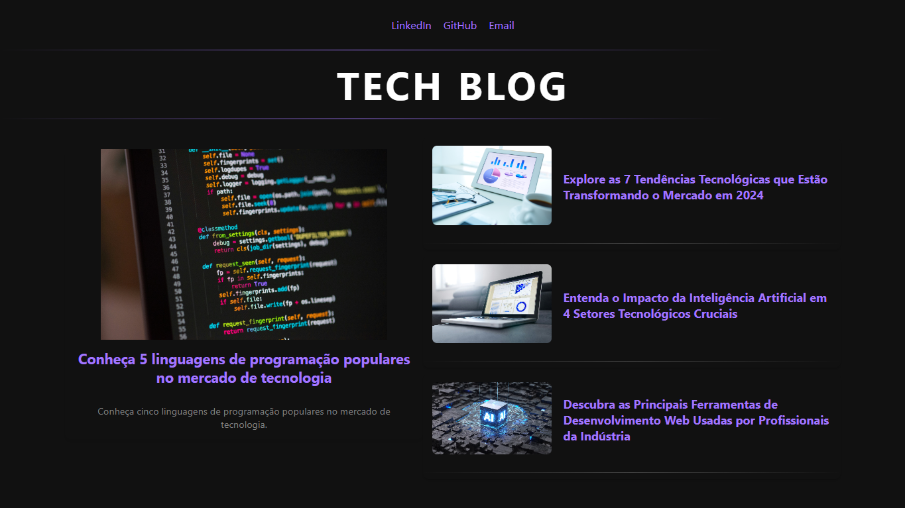

# 🅰️ Angular Blog

Este projeto é uma simulação de um blog desenvolvido com Angular. O objetivo é criar uma página de blog interativa, utilizando os principais conceitos e boas práticas de desenvolvimento front-end com Angular.



## ⚙️ Funcionalidades

* **Página inicial**: Exibe uma lista de posts do blog com títulos, imagens e resumos.
* **Página de detalhes**: Mostra o conteúdo completo do post ao clicar em um item da lista.
* **Adicionar novas notícias**: Permite adicionar novas notícias de maneira dinâmica através dos componentes do Angular.
* **Responsividade**: Layout ajustável para diferentes dispositivos (desktop, tablet e mobile).

## 🛠️ Tecnologias Utilizadas

* **Angular**: Estrutura principal do projeto.
* **TypeScript**: Linguagem de programação utilizada no desenvolvimento.
* **HTML5** e **CSS3**: Para construção do layout e estilização.

## 🚀 Como Executar o Projeto

1. Clone o repositório:
```bash
git clone https://github.com/joschonarth/angular-blog
```

2. Navegue até o diretório do projeto:
```bash
cd cd angular-blog
```

3. Instale as dependências do Node:
```bash
npm install
```

4. Execute a aplicação:
```bash
ng serve
```

5. Acesse a aplicação em seu navegador:
```bash
http://localhost:4200
```


## 📞 Contato 

<div>
    <a href="https://www.linkedin.com/in/joschonarth/" target="_blank"></a>
    <a href="mailto:joschonarth@gmail.com" target="_blank"></a>
</div>
